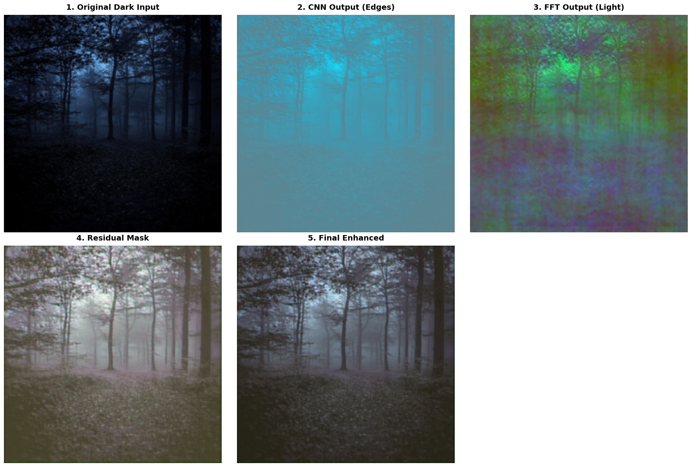

# Deep Dive: The Mathematics of NanoLILY

While the primary architecture document outlines the structural flow of the NanoLILY core, this document serves as an engineering reference for the underlying tensor mathematics, spatial illusions, and frequency-domain mechanics that make the 129K parameter model effective.

## 1. The Scale Illusion & Residual Power

A common mathematical doubt regarding residual connections is how an output bounded by a `Tanh()` activation (which outputs values strictly between `[-1.0, 1.0]`) can significantly alter a standard image pixel (traditionally scaled `[0, 255]`).

**The Mathematical Reality:**
The input tensors are not on a `[0, 255]` scale. PyTorch's `transforms.ToTensor()` automatically normalizes pixel values to a continuous range of `[0.0, 1.0]`, where `0.0` is pure black and `1.0` is pure white.

Because the input is so strictly bounded, the `[-1.0, 1.0]` residual has massive mathematical leverage over the image's dynamic range.

* If a dark pixel in the input tensor has a value of `0.05` (pitch black).
* The network's spatial and frequency branches calculate a required illumination shift of `+0.85`.
* `0.05 + 0.85 = 0.90` (The pixel is transformed instantly into a brightly illuminated texture).

The residual is not making negligible adjustments; it possesses the mathematical capacity to span and invert the entire dynamic range of the image in a single addition step.

## 2. The FFT Branch: Amplitude vs. Phase

When `torch.fft.rfft2` converts the spatial image into the frequency domain, it does not separate "brightness" and "structure" into real and imaginary numbers. It outputs complex numbers in the format $a + bi$.

In signal processing, image characteristics are dictated by:

* **Amplitude (Intensity):** $\sqrt{a^2 + b^2}$
* **Phase (Spatial Position/Structure):** $\arctan(\frac{b}{a})$

**Why a Real-Valued Mask is Used:**
The learnable weight matrix (`self.freq_mask`) is a real-valued scalar tensor initialized at `0.01`. Let's define this real scalar as $S$. When we multiply the complex frequency tensor by this real scalar, the math distributes to both parts: $S(a + bi) = Sa + Sbi$.

The resulting shift proves why the high-frequency structure is protected:

1. **The New Amplitude** becomes $S \times \sqrt{a^2 + b^2}$. The intensity of the global lighting is successfully scaled.
2. **The New Phase** becomes $\arctan(\frac{Sb}{Sa})$. The $S$ perfectly cancels out, leaving the original $\arctan(\frac{b}{a})$ untouched.

By utilizing a real-valued mask, the network is mathematically forced to strictly scale the intensity of the light falloff (Amplitude) while making it mathematically impossible to accidentally shift the position of the underlying structural edges (Phase).

## 3. The Fusion Layer as a Learnable Mixer

Before the final residual addition, the outputs of the CNN branch and the FFT branch are concatenated into a 6-channel tensor and passed through a `1x1` convolution.

**The Input States:**

* **The FFT Output:** Represents a smooth, blurry, highly-illuminated color map of the scene. It calculates the perfect global lighting context but lacks high-frequency sharpness.
* **The CNN Output:** Represents highly pronounced edges, noise, and local textures, but lacks global exposure awareness.

**The 1x1 Convolution:**
This layer acts as a **Learnable Pixel-Wise Mixer**. It does not just make minor adjustments; it calculates a mathematical weighted average across the 6 channels for every single pixel. It allows the network to effectively state: *"Use the FFT branch to generate the smooth global spotlight, and use the CNN branch to draw the high-frequency textures inside that spotlight."*

The output is a 3-channel **Enhancement Map** that binds the global illumination shift and the spatial texture recovery into a single tensor, which is then added to the original dark input to get final enhanced image.

## 4. Visual Proof of Branch Separation

To prove that the dual-branch architecture successfully decouples high-frequency textures from low-frequency illumination, we can intercept and visualize the intermediate tensors immediately before the `1x1` fusion layer.

**Visual Breakdown:**
1. **Original Dark Input:** The baseline `[0.0, 1.0]` tensor.
2. **CNN Output (Branch A):** The spatial convolutions hunt for local pixel variances. Visually, this output resembles a high-pass filter or edge-detector. It proves the CNN is strictly amplifying the microscopic gravel, leaf, and structural textures hidden in the dark.
3. **FFT Output (Branch B):** The frequency mask scales the amplitude of the low frequencies. Visually, this output is a smooth, glowing color gradient. It proves the FFT branch completely ignores sharp edges and acts purely as a global illumination map.
4. **Residual Mask (The Fusion):** The `1x1` convolution learns to mix the sharp edges of the CNN with the glowing spotlight of the FFT, bounding the result via `Tanh()` to create the final `[-1.0, 1.0]` Enhancement Map.
5. **Final Enhanced Output:** The residual map mathematically added to the dark input (`identity + residual`), fully restoring the image without destroying the original structural phase.