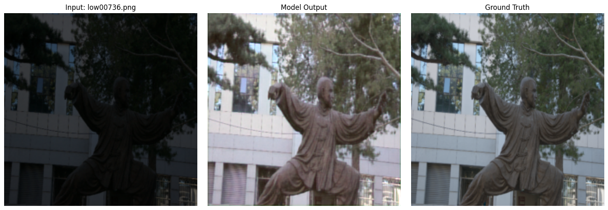

# NanoLILY & LILY Bloom: Ultra-Lightweight Low-Light Image Enhancement System

> A complete computer vision pipeline featuring a 129K-parameter UNet-FFT core model (NanoLILY) paired with a seamless 2D-Hanning inference engine (LILY Bloom) to restore illumination in arbitrary high-resolution images.


## 📂 Repository Structure (How to Navigate)

```text
NanoLILY/
├── assets/
│   ├── bloom_engine_gallery/              # LILY Bloom Engine visual outputs
│   ├── failure_cases_images/              # Failure-case and limitation samples
│   └── model_evaluation/                  # Evaluation visuals and comparisons
│
├── dataset/
│   ├── dataset.md                         # links to LoL v1 and LoL v2 dataset  
│
├── docs/
│   └── architecture.md                    # Model architecture and design decisions
│
├── model/
│   └── NanoLILY.md                        # Link of pre-trained weights for NanoLILY hosted on Kaggle
│
├── notebook/
│   ├── NanoLILY_baseline.ipynb            # Baseline training & experiments
│   └── Fine_tuning_NanoLILY.ipynb         # Fine-tuning experiments
│
├── results/
│   └── Evaluation.ipynb                   # Notebook for evaluation results
│   ├── LILY_Bloom_Engine_stress_test.md   # Real-world stress tests & observations                                
│   └── NanoLILY_results_visualization.md  # Quantitative + qualitative result analysis
│   └── failure_cases.md                   # Failure cases images     
│
├── demo.ipynb                             # Plug-and-play inference demo
├── readme.md                              # Project overview and usage
├── requirements-demo.txt                  # Dependencies for demo notebook
└── requirements-training.txt              # Full training dependencies
```

## 🚀 Getting Started (Quickstart)

Want to test the NanoLILY Core and LILY Bloom Engine on your own images? The fastest way is to use our interactive demo.

1. **Clone the repository:**
   ```
   git clone https://github.com/Sanjeet2835/NanoLILY.git
   cd NanoLILY
   ```
   OR
   **Only download the demo.ipynb and requirements-demo.txt**
   
2. **Install the lightweight demo dependencies:**
   ```
   pip install -r requirements-demo.txt
   ```
   
3. **Download the NanoLILY model from kaggle**:
   https://www.kaggle.com/models/sanjeet2824/nanolily
   
4. **Run the Demo:** Open demo.ipynb, set your image path and model path in the User Control Panel, and run the cells to instantly visualize the 3-way comparison (Input vs. Core vs. Bloom Engine).
  
## 🌸 System Architecture: Two Pillars
This repository tackles the problem of low-light image enhancement through two distinct engineering focuses: the mathematical core that learns the illumination mapping, and the deployment system that scales it.

### Pillar I: The Core Model (NanoLILY)
NanoLILY achieves competitive structural recovery on low-light datasets not by scaling up massive transformer blocks, but by combining a microscopic spatial CNN with a globally learnable Fast Fourier Transform (FFT) mask.
* **Extreme Efficiency:** Operates at just **129K trainable parameters**, bypassing the massive memory costs of traditional self-attention mechanisms and making it highly suitable for edge devices.
* **Dual-Branch Architecture:** Utilizes a shallow spatial CNN branch to capture local pixel textures, running in parallel with an FFT-based frequency branch (`torch.fft.rfft2`) to capture global illumination context.
* **Perceptual Optimization:** Trained using a composite loss function blending VGG-19 Perceptual Loss, Structural Similarity (SSIM), and L1 Pixel loss to ensure outputs are structurally sound.

### Pillar II: The Inference Engine (LILY Bloom)
Because global FFT masks are mathematically locked to their training resolution (224x224), passing high-res images directly into NanoLILY causes tensor shape mismatches, while simply downsampling them to 224x224 before input destroys high-frequency detail. LILY Bloom is the inference pipeline built to solve this by slicing high-res images into native patches and seamlessly blending them back together.
* **Resolution Independence:** LILY Bloom uses a sliding-window algorithm to slice arbitrary high-resolution images into overlapping patches, processing each through the NanoLILY core natively.
* **Seamless Blending:** To prevent the visible "checkerboard" seams caused by global frequency shifts between adjacent patches, LILY Bloom applies a mathematical **2D Hanning Window** to each output tensor. This forces the edges of every patch to smoothly fade to 0% opacity, allowing them to blend perfectly into a massive, uninterrupted high-resolution output.

---

## 🧠 Training Strategy: Two-Stage Pipeline

To maximize the model's ability to generalize across different low-light conditions, the training was executed in a two-phase pipeline:

1. **Phase 1: Baseline Pre-Training (LoL v1 Dataset)**
* **Notebook:** [NanoLILY.ipynb](https://github.com/Sanjeet2835/NanoLILY/blob/main/notebook/NanoLILY%20baseline.ipynb)
* The model was trained from scratch for 200 epochs on the standard LoL v1 dataset to learn the fundamental mapping between low-light degradation and target illumination.
* **Dynamic Loss Strategy:** SSIM weight was intentionally kept low (`0.01`) for the first 50 epochs to focus strictly on pixel-level illumination recovery (PSNR/L1). At epoch 51, the weight was scaled up 20x to `0.20` to refine structural edges and focus on perceptual quality once the baseline brightness was achieved.


2. **Phase 2: Fine-Tuning & Adaptation (LoL v2 Dataset)**
* **Notebook:** [Fine tuning NanoLILY.ipynb](https://github.com/Sanjeet2835/NanoLILY/blob/main/notebook/Fine%20tuning%20NanoLILY.ipynb)
* The pre-trained baseline was fine-tuned on the LoL v2 dataset (Real_captured) to adapt to its specific noise profiles and distribution shifts.
* **Refined Optimization:** The SSIM weight was strictly maintained at `0.2` from epoch 0. The learning rate was managed via a `ReduceLROnPlateau` scheduler, and training was monitored with an Early Stopping callback (patience=10, min_delta=0.00001) targeting maximum `val_ssim`.


---

## 📊 Performance Metrics (NanoLILY Core)

Evaluation yields highly efficient structural recovery relative to the minimal parameter count (129K). Recent standalone evaluations conducted in pure 32-bit floating-point precision revealed the true mathematical accuracy of the architecture, demonstrating a significant improvement over earlier training-time estimates.

**LoL-v2 (Real_Captured) Benchmark:**
* **Validation PSNR:** 19.19 dB
* **Validation SSIM:** 0.825
* **VGG Perceptual Loss:** 0.662
* **Charbonnier Loss:** 0.091
* **FFT Frequency Loss:** 0.017
* **Color Loss:** 0.016

### 📖 Metrics Legend (How to Read These Scores)
Not all deep learning metrics operate on a 0-to-1 percentage scale. Here is a quick guide to understanding the NanoLILY evaluation scores:

* **The Percentage Metrics (Bounded 0 to 1):**
  * **SSIM (0.825):** Structural Similarity is a strict percentage. A score of 0.825 means the generated image has an **82.5% structural and contrast alignment** with the ground-truth photograph.
  * **Color Loss (0.016):** Calculated via Cosine Similarity, this measures the angle between RGB vectors. A score of 0.016 indicates the hue and tint of the enhanced image are **over 98.4% perfectly aligned** with the target.

* **The Distance Metrics (Lower is Better, No Maximum):**
  * **VGG & FFT Loss (0.662 & 0.017):** These are absolute mathematical distances in high-dimensional feature spaces, *not percentages*. They measure how far off the generated textures (VGG) and global light falloff (FFT) are from the real image. Scores this close to zero indicate highly realistic, sharp detail recovery without frequency distortion.
  * **Charbonnier Loss (0.091):** A smoothed L1 pixel penalty. It indicates that the absolute brightness of any given pixel is, on average, within a ~9% margin of error of the true image.

* **The Logarithmic Metric:**
  * **PSNR (19.19 dB):** Peak Signal-to-Noise Ratio is measured in decibels. For an ultra-lightweight 129K parameter model tackling extreme low-light degradation, approaching 20 dB represents a highly competitive signal recovery with minimal artifact generation.

### 🔍 Evaluation Methodology: Precision Benchmarking
To guarantee the highest level of mathematical accuracy, all final metrics reported above were calculated using a strict, standalone evaluation script in pure `32-bit float` precision.

---

## Visual Results

### 1. High-Resolution Deployment (LILY Bloom Engine)
By utilizing the sliding-window Hanning inference, the system can process massive arbitrary images without memory crashes or visible seams.
*(Left: Raw Input | Right: LILY Bloom Engine)*


[➡️ Click Here to view the Real-World Stress Test Gallery](https://github.com/Sanjeet2835/NanoLILY/blob/main/results/LILY%20Bloom%20Engine%20stress%20test.md)

### 2. Standard Benchmark Recovery (NanoLILY Core)
On the standard LoL Dataset benchmarks, the 129K-parameter core achieves highly efficient structural recovery.
*(Images: Input / NanoLILY / Target)*

### low00736



---

### low00748


---


[➡️ Click Here to View the Full Gallery of 40+ Evaluation Samples](https://github.com/Sanjeet2835/NanoLILY/blob/main/results/NanoLILY%20results%20visualization.md)

---


## 🚧 Current Limitations (NanoLILY v1)

NanoLILY v1 successfully proves that a microscopic (129K parameter) hybrid network can achieve professional-grade low-light enhancement. However, real-world stress testing has revealed a few distinct architectural boundaries:

### 1. The HDR Saturation Problem (Blown-out Highlights)
* **The Issue:** When an image has a pitch-black background but intense, localized light sources (like a streetlamp or neon sign), the model tends to "blow them out," resulting in pure white clipping. 
* **The Cause:** The Global FFT branch calculates a global brightness shift for the image. Because it lacks local exposure awareness, it uniformly lifts the brightness of already-illuminated pixels along with the shadows.

### 2. The "Fake Global" Paradox in High-Res Upscaling
* **The Issue:** When enhancing massive 4K images, large continuous areas (like a dark night sky) can occasionally exhibit slightly uneven lighting across different zones.
* **The Cause:** The LILY Bloom engine slices images into 224x224 patches. Consequently, the FFT branch is only calculating the "global" illumination of that specific patch, not the contextual lighting of the entire 4K image.

### 3. Sensor Noise Amplification
* **The Issue:** When processing extreme low-light photos from real-world smartphone sensors, the model occasionally amplifies ISO grain and color static on flat surfaces (like dark walls).
* **The Cause:** The spatial U-Net branch is highly sensitive to microscopic high-frequency changes and can mistake raw sensor noise for physical texture, enhancing the static instead of smoothing it.

### 4. Color Constancy Shifts
* **The Issue:** The enhanced outputs occasionally suffer from unnatural color casts (e.g., overly warm/yellow or cool/blue tints), subtly altering the original atmosphere of the scene.
* **The Cause:** The current L1 and VGG Perceptual losses operate purely in the RGB color space. They mathematically prioritize structural recovery and average pixel intensity over strict hue preservation.

You can checkout [Failure Cases](https://github.com/Sanjeet2835/NanoLILY/blob/main/results/failure_cases.md)
