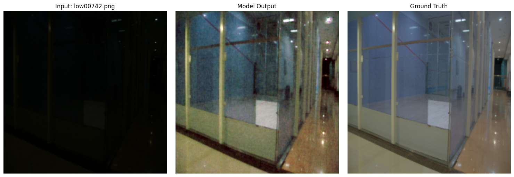
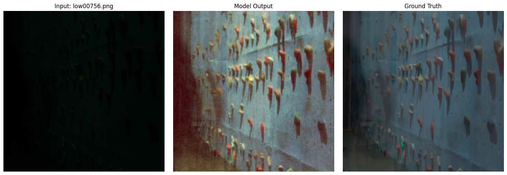

# NanoLILY & LILY Bloom: Ultra-Lightweight Low-Light Image Enhancement System

> A complete computer vision pipeline featuring a 129K-parameter CNN-FFT core model (NanoLILY) paired with a seamless 2D-Hanning inference engine (LILY Bloom) to restore illumination in arbitrary high-resolution images.


## 🌸 System Architecture: Two Pillars
This repository tackles the problem of low-light image enhancement through two distinct engineering focuses: the mathematical core that learns the illumination mapping, and the deployment system that scales it.

### Pillar I: The Core Model (NanoLILY)
NanoLILY achieves competitive structural recovery on low-light datasets not by scaling up massive transformer blocks, but by combining a microscopic spatial CNN with a globally learnable Fast Fourier Transform (FFT) mask.
* **Extreme Efficiency:** Operates at just **129K trainable parameters**, bypassing the massive memory costs of traditional self-attention mechanisms and making it highly suitable for edge devices.
* **Dual-Branch Architecture:** Utilizes a shallow spatial CNN branch to capture local pixel textures, running in parallel with an FFT-based frequency branch (`torch.fft.rfft2`) to capture global illumination context.
* **Perceptual Optimization:** Trained using a composite loss function blending VGG-19 Perceptual Loss, Structural Similarity (SSIM), and L1 Pixel loss to ensure outputs are structurally sound.

### Pillar II: The Inference Engine (LILY Bloom)
Because global FFT masks are mathematically locked to their training resolution (224x224), passing arbitrary 1080p/4K images directly into NanoLILY causes tensor shape mismatches. **LILY Bloom** is the inference pipeline built to solve this.
* **Resolution Independence:** LILY Bloom uses a sliding-window algorithm to slice arbitrary high-resolution images into overlapping patches, processing each through the NanoLILY core natively.
* **Seamless Blending:** To prevent the visible "checkerboard" seams caused by global frequency shifts between adjacent patches, LILY Bloom applies a mathematical **2D Hanning Window** to each output tensor. This forces the edges of every patch to smoothly fade to 0% opacity, allowing them to blend perfectly into a massive, uninterrupted high-resolution output.

---

## 📂 Repository Structure

```
NanoLILY/
├── dataset/                     # Training and validation datasets (LoL v1 & LoL v2)
├── notebooks/                   # Core code: Pre-training, fine-tuning, and inference
├── model/                       # Saved PyTorch Lightning checkpoints (.ckpt / .pth)
├── results/                     # Visual evaluations and metrics
│   ├── sample-wise-evaluation/  # 40+ generated Before/After/Target grids
│   └── all-results.md           # Scrollable markdown gallery of all test samples
├── docs/                        # Deep-dive documentation (Architecture maps, logs)
├── README.md                    # Project overview and quickstart
├── GETTING_STARTED.md           # Installation, dataset setup, and usage instructions
└── requirements.txt             # Python dependencies

```

---

## 🧠 Training Strategy: Two-Stage Pipeline

To maximize the model's ability to generalize across different low-light conditions, the training was executed in a two-phase pipeline:

1. **Phase 1: Baseline Pre-Training (LoL v1 Dataset)**
* **Notebook:** [NanoLILY.ipynb](https://github.com/Sanjeet2835/NanoLILY/blob/main/notebook/NanoLILY%20baseline.ipynb)
* The model was trained from scratch for 200 epochs on the standard LoL v1 dataset to learn the fundamental mapping between low-light degradation and target illumination.
* **Dynamic Loss Strategy:** SSIM weight was intentionally kept low (`0.01`) for the first 50 epochs to focus strictly on pixel-level illumination recovery (PSNR/L1). At epoch 51, the weight was scaled up 20x to `0.20` to refine structural edges and focus on perceptual quality once the baseline brightness was achieved.


2. **Phase 2: Fine-Tuning & Adaptation (LoL v2 Dataset)**
* **Notebook:** [Fine tuning NanoLILY.ipynb](https://github.com/Sanjeet2835/NanoLILY/blob/main/notebook/Fine%20tuning%20NanoLILY.ipynb)
* The pre-trained baseline was fine-tuned on the LoL v2 dataset (Real_captured) to adapt to its specific noise profiles and distribution shifts.
* **Refined Optimization:** The SSIM weight was strictly maintained at `0.2` from epoch 0. The learning rate was managed via a `ReduceLROnPlateau` scheduler, and training was monitored with an Early Stopping callback (patience=10, min_delta=0.00001) targeting maximum `val_ssim`.


---

## 📊 Performance Metrics (NanoLILY Core)

Evaluation yields highly efficient structural recovery relative to the minimal parameter count:

* **Validation SSIM:** ~0.797
* **Validation PSNR:** ~18.64 dB
* **Validation Loss:** ~0.168


---

## Visual Results
Below are a few sample outputs demonstrating the model's ability to recover illumination and structure.


### low00736


---

### low00742



---

### low00748


---

### low00756



---

### low00758


---


[➡️ Click Here to View the Full Gallery of 40+ Evaluation Samples](https://github.com/Sanjeet2835/NanoLILY/blob/main/results/all-results.md)


## 🔮 Known Limitations & Future Scope

* **Mitigating OOD Sensor Noise:** Currently, aggressively amplifying out-of-distribution (OOD) dark images amplifies baseline sensor noise (e.g., green grain on homogeneous surfaces like walls, due to camera Bayer filter physics). Future training iterations will incorporate a **Total Variation (TV) Loss** penalty alongside SSIM/L1 to naturally smooth flat spatial regions without requiring post-processing DSP filters.

---

**🛠️ Want to run the code? Check out the [Getting Started Guide]() for installation and inference instructions.**
