# 📸 LILY Bloom Engine: Real-World Gallery

The following images demonstrate the Bloom Engine's ability to handle arbitrary resolutions and aspect ratios using seamless patch reconstruction.

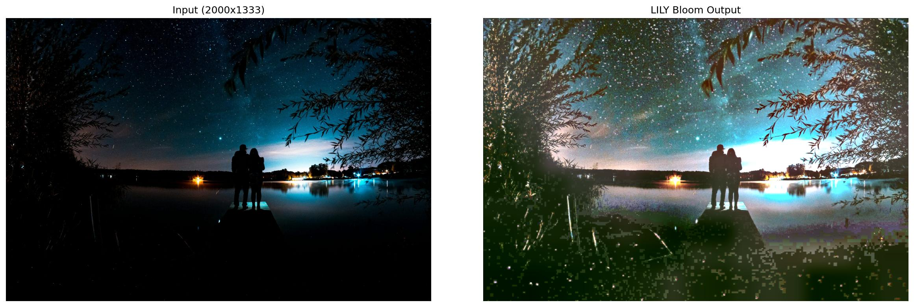

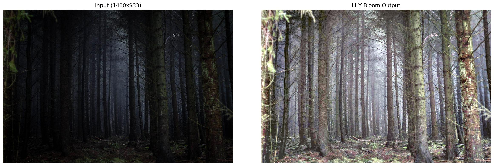

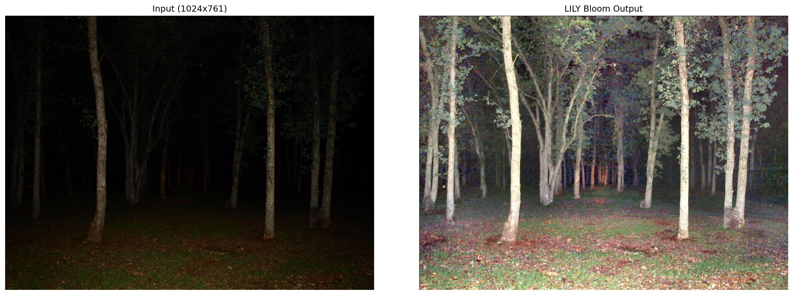

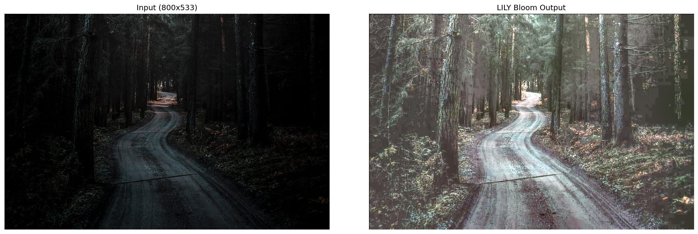

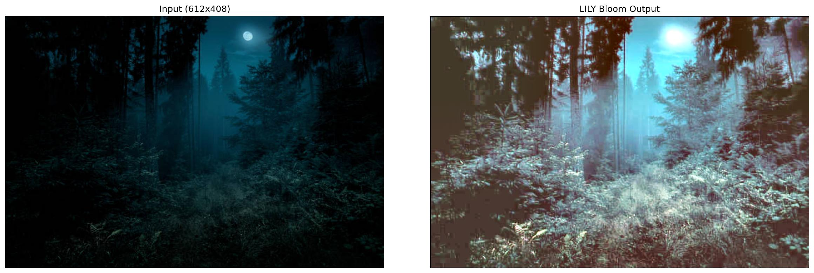

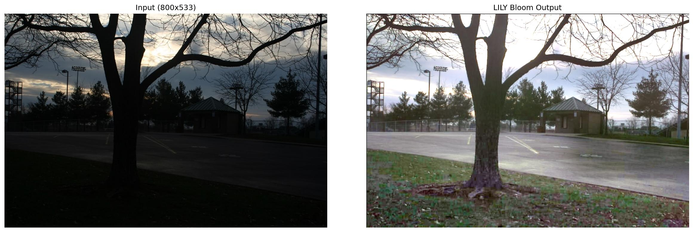

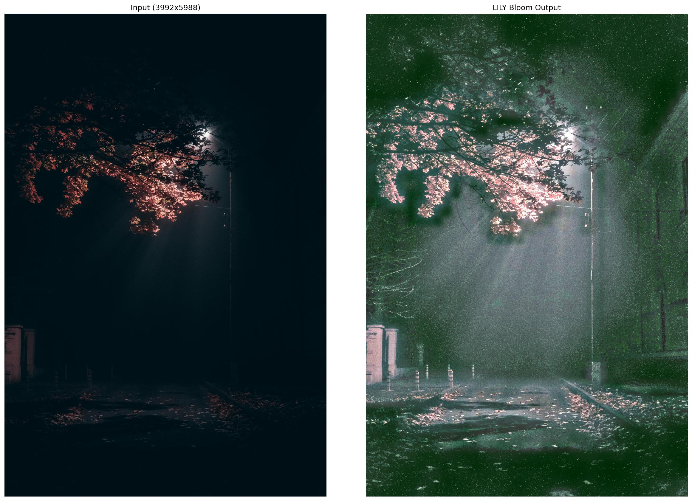

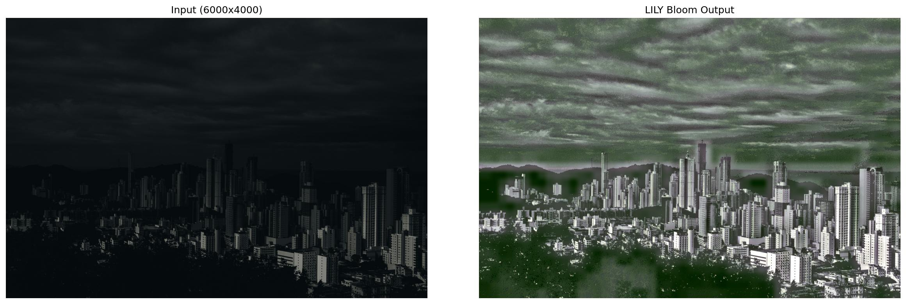

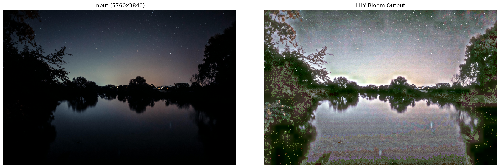

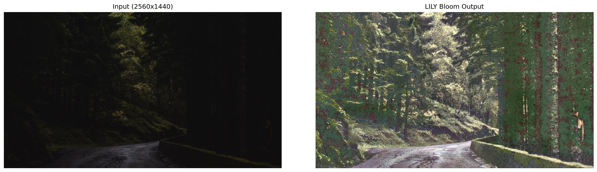

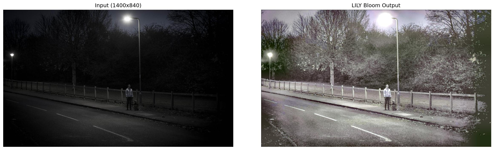
