# 🖼️ Model Evaluation Gallery

This document contains the automated batch evaluation of the test dataset, comparing the dark inputs, the 129K-parameter model outputs, and the ground truth targets.

---

### low00690

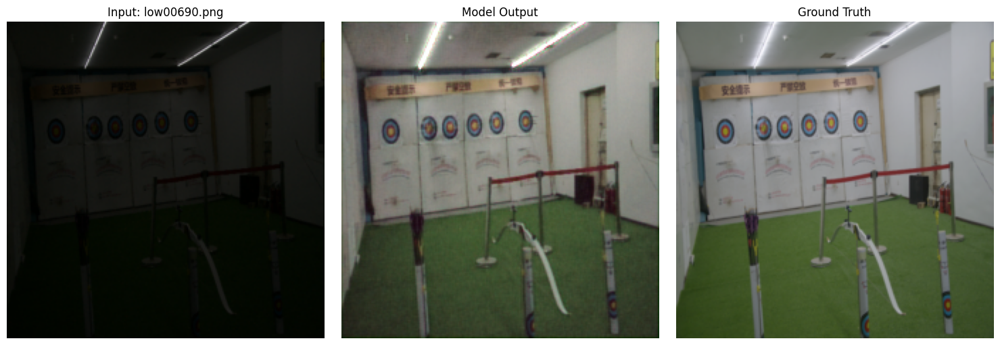

---

### low00693

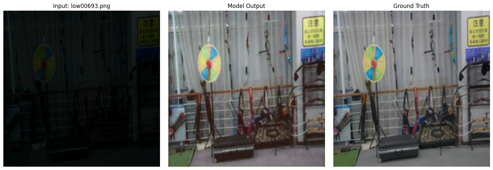

---

### low00694

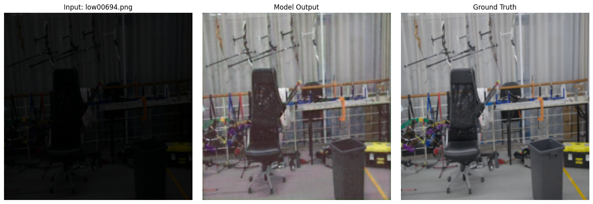

---

### low00695

---

### low00696

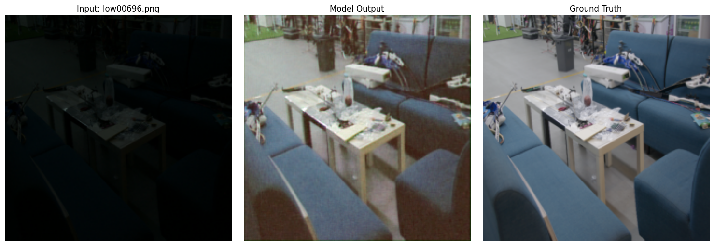

---

### low00701

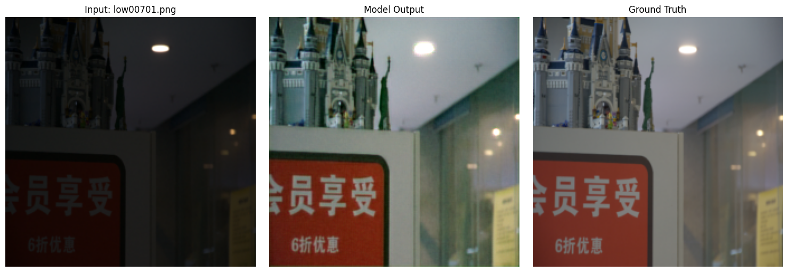

---

### low00704

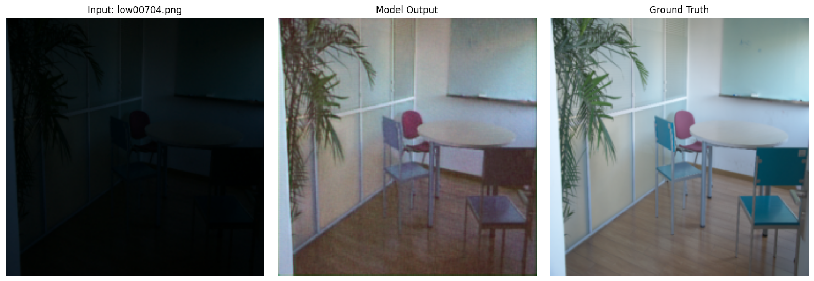

---

### low00706

---

### low00708

---

### low00710

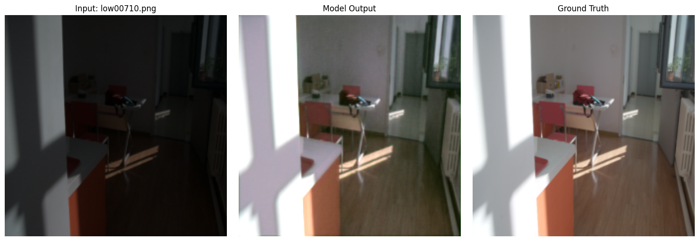

---

### low00712

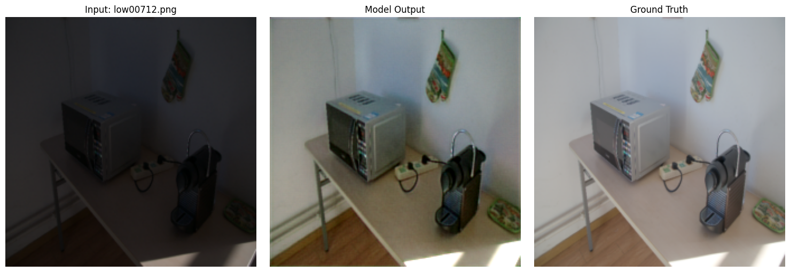

---

### low00714

---

### low00717

---

### low00718

---

### low00720

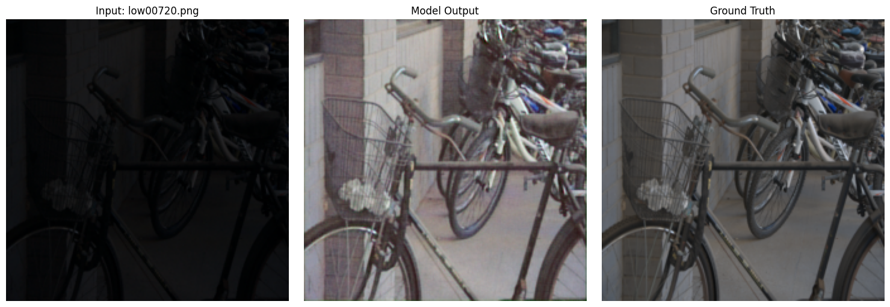

---

### low00722

---

### low00725

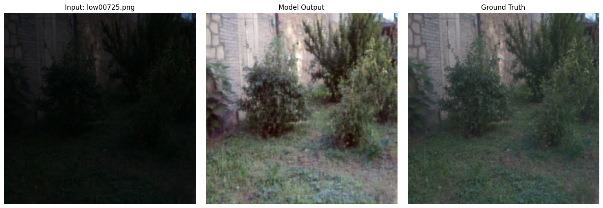

---

### low00727

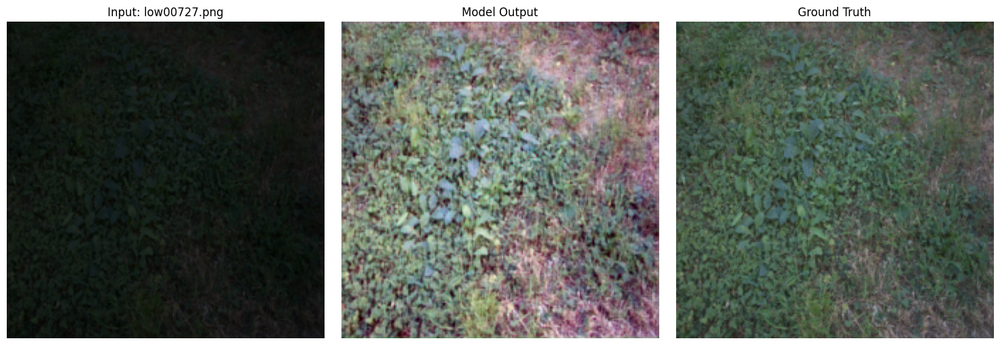

---

### low00730

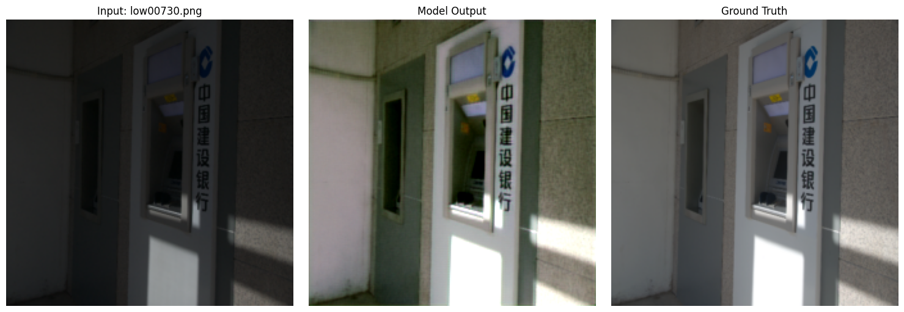

---

### low00731

---

### low00734

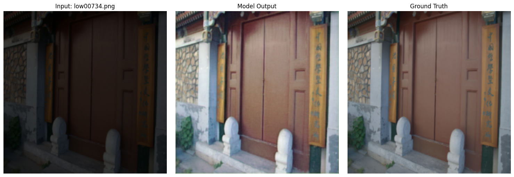

---

### low00736

---

### low00738

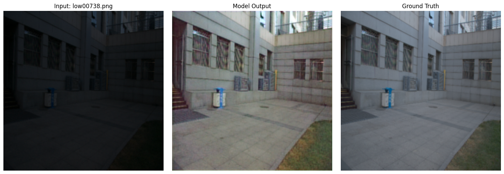

---

### low00740

---

### low00742

---

### low00744

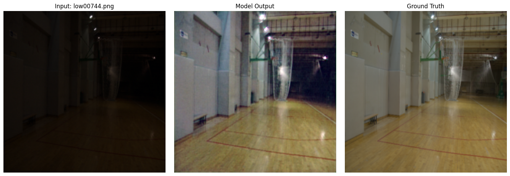

---

### low00746

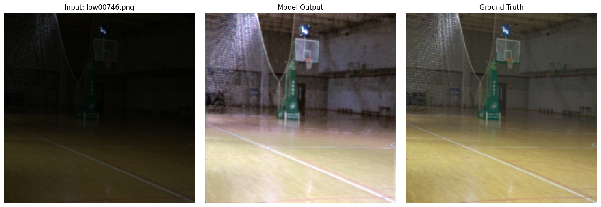

---

### low00748

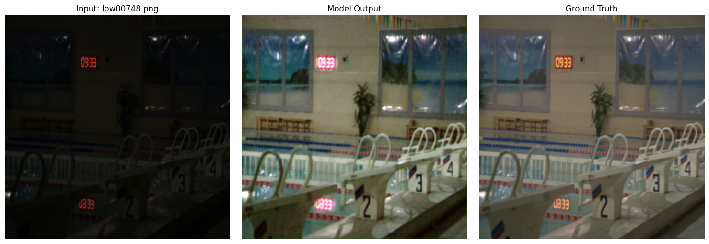

---

### low00750

---

### low00752

---

### low00756

---

### low00758

---

### low00760

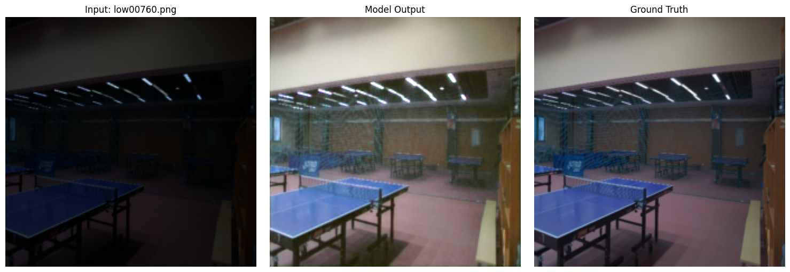

---

### low00762

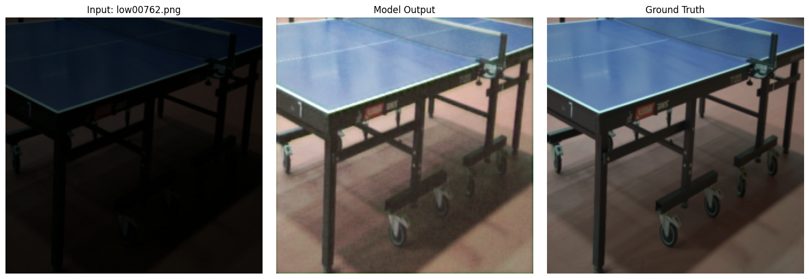

---

### low00764

---

### low00765

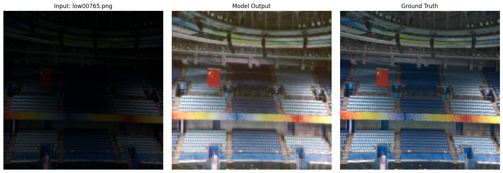

---

### low00767

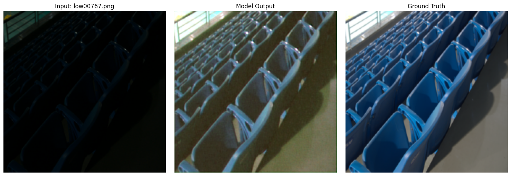

---

### low00770

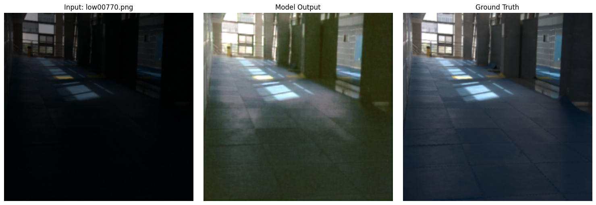

---

### low00772

---

### low00774

---

### low00778

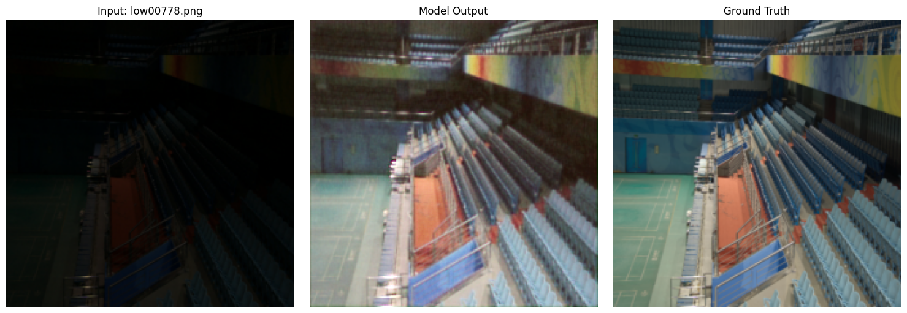

---

### low00780

---

### low00786

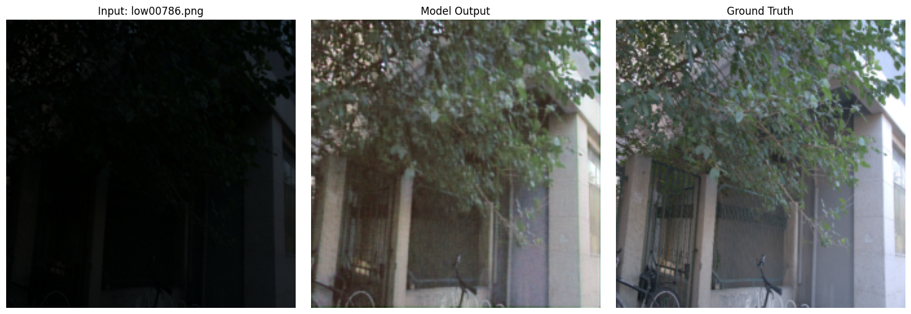

---

### low00789

---
